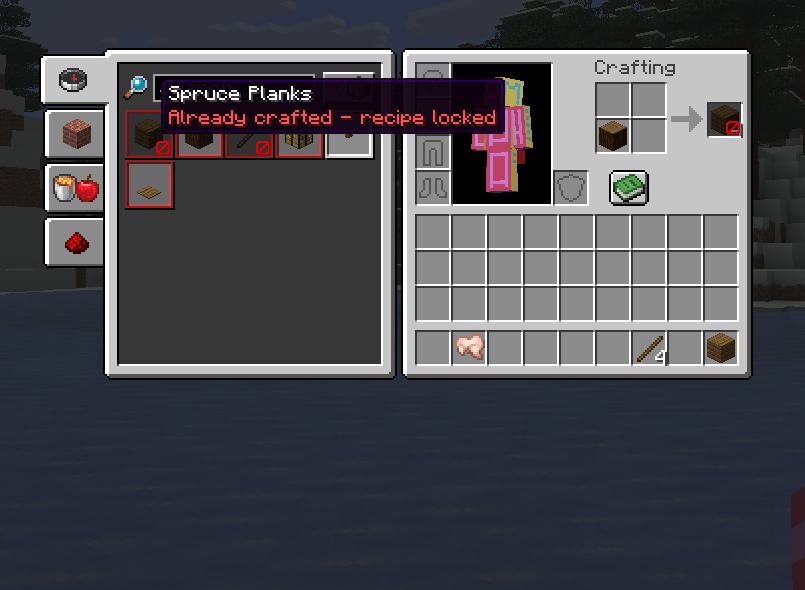
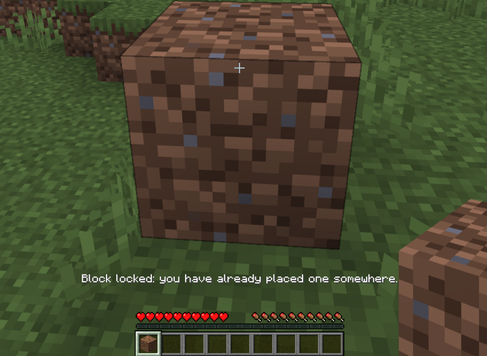

# Craft & Block Lock

Craft & Block Lock is a Fabric challenge mod for Minecraft Java Edition 26.2.

Each player can craft every recipe once. The optional block rule also allows only one active placement of each block item at a time. Break the placed block to use that block type again.

## Main features

- One craft per Minecraft recipe ID and player
- One active placement per block item type and player
- Progress saved across logouts and server restarts
- Creative mode bypass enabled by default
- Locked recipes marked in the recipe book and result slot
- Server-side checks with client-side prediction blocking
- Messages, sounds, visuals, exceptions and resets are configurable
- Optional Mod Menu settings screen with recipe and block exception management

## Screenshots

| Locked recipe visuals | Active block limit |
|---|---|
|  |  |

## How recipe locks work

The recipe itself is locked, not the output item.

- Every Minecraft recipe ID can be completed once per player.
- Different recipe IDs remain separate even if they create the same item.
- Ingredient choices within the same recipe ID do not provide extra uses.
- For example, crafting sticks once locks the stick recipe regardless of the plank type used.
- A crafting-table recipe and a stonecutter recipe remain separate when their IDs are different.

Blaze Powder and Eyes of Ender are exempt by default so normal survival progression remains possible.

## How block locks work

The block rule tracks placements by block item type.

- A player may have one active placement of each block type.
- Breaking the tracked block unlocks that type.
- Another player breaking it also releases the original owner's lock.
- If a tracked block changes into another block type, the original type is released and the new type becomes locked. For example, dirt becoming grass unlocks dirt and locks grass.
- Active placements are reconciled automatically, covering natural transformations, explosions and similar world changes.
- Run `/cbl blocks list [page]` to see your active block locks.
- Run `/cbl recipes list [page]` to see your locked recipe IDs.

## Supported crafting paths

- Player inventory crafting
- Crafting table
- Furnace, blast furnace and smoker
- Stonecutter
- Smithing table
- Brewing stand transformations
- Crafter outputs
- Campfire and soul campfire cooking
- Modded recipes using the matching vanilla recipe and output paths

Anvils, enchanting tables, grindstones, looms and cartography tables remain freely usable.

## Installation

1. Install Fabric Loader 0.19.3 or newer for Minecraft 26.2.
2. Install Fabric API 0.156.0+26.2 or a compatible newer 26.2 build.
3. Put `craft-block-lock-1.0.0-rc.2.jar` in the `mods` folder.
4. Install the mod on the server and all connecting clients for multiplayer.
5. Start Minecraft with Java 25.

[Mod Menu](https://modrinth.com/mod/modmenu) 20.0.0 or newer is optional. It provides a settings screen for local and single-player configuration, including recipe and block exceptions. Dedicated multiplayer server settings remain controlled by operator commands.

## Commands

Run `/cbl help` in game for the command list. Commands that change settings or reset progress require game-master permission.

| Command | Purpose |
|---|---|
| `/cbl status` | Show the current settings |
| `/cbl help` | Show commands available to you |
| `/cbl recipes list [page]` | Show your locked recipes |
| `/cbl blocks list [page]` | Show your active block locks |
| `/cbl craft on\|off` | Enable or disable recipe locking |
| `/cbl blocks on\|off` | Enable or disable block locking |
| `/cbl creative-bypass on\|off` | Toggle the Creative mode bypass |
| `/cbl feedback messages on\|off` | Toggle denial messages |
| `/cbl feedback sounds on\|off` | Toggle denial sounds |
| `/cbl feedback visuals on\|off` | Toggle locked recipe visuals |
| `/cbl reset <player> recipes` | Reset a player's recipe history after confirmation |
| `/cbl reset <player> blocks` | Reset a player's active block locks after confirmation |
| `/cbl reset <player> all` | Reset all progress for a player after confirmation |
| `/cbl exceptions recipe <list\|add\|remove>` | Manage unlimited recipes |
| `/cbl exceptions block <list\|add\|remove>` | Manage unlimited block items |
| `/cbl reload` | Reload `craftblocklock.json` |

Recipe and block arguments support in-game suggestions. Reset confirmations expire after 15 seconds.

## Configuration

The mod creates `config/craftblocklock.json` on first launch. Commands save changes immediately.

```json
{
  "recipeLockEnabled": true,
  "blockLockEnabled": true,
  "creativeModeBypass": true,
  "messagesEnabled": true,
  "denialSoundsEnabled": true,
  "lockedRecipeVisualsEnabled": true,
  "recipeExceptions": [
    "minecraft:blaze_powder",
    "minecraft:ender_eye"
  ],
  "blockExceptions": []
}
```

The denial sound uses Minecraft's Players sound category. The Master Volume and Players sliders control it.

## Current testing status

Single-player testing is in progress for the 1.0 release. Multiplayer support is implemented but has not been tested yet. Please report issues with the Minecraft version, Fabric versions and steps needed to reproduce the problem.

## Build from source

Java 25 and Gradle 9.5 are required.

```bash
./gradlew build
```

The installable JAR is written to `build/libs/`.

## License

Craft & Block Lock is available under the MIT License.


Created by passo.
